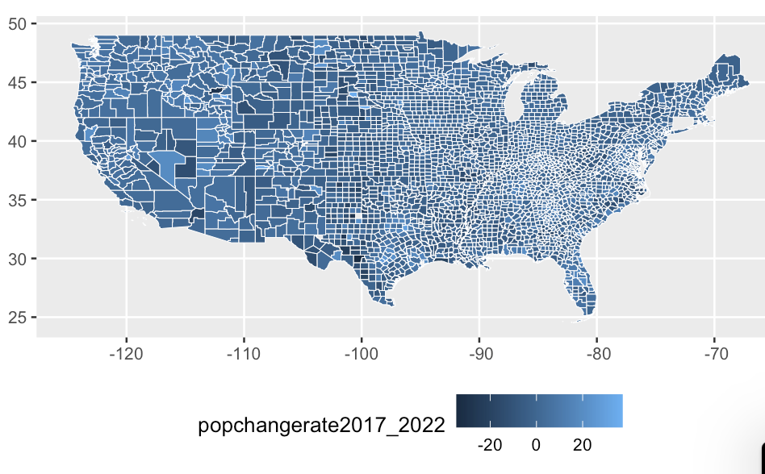
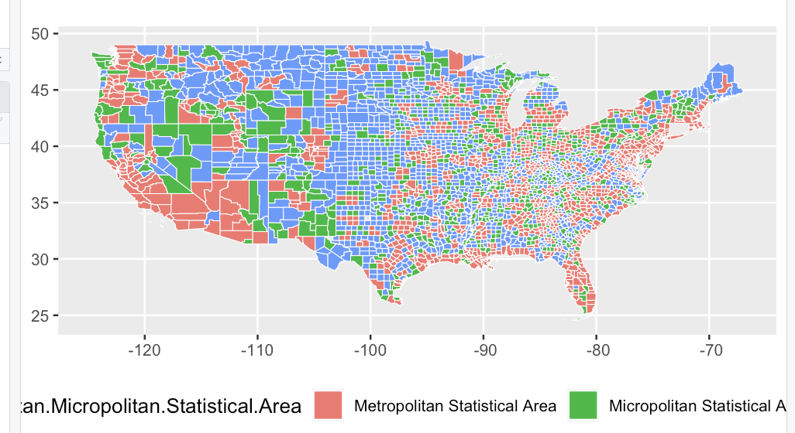
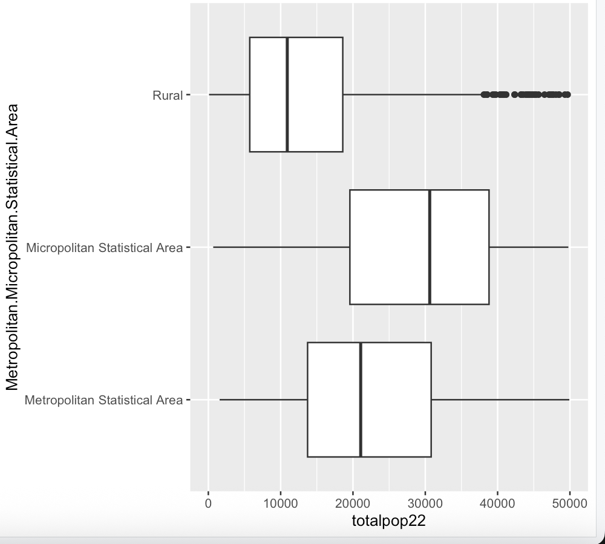
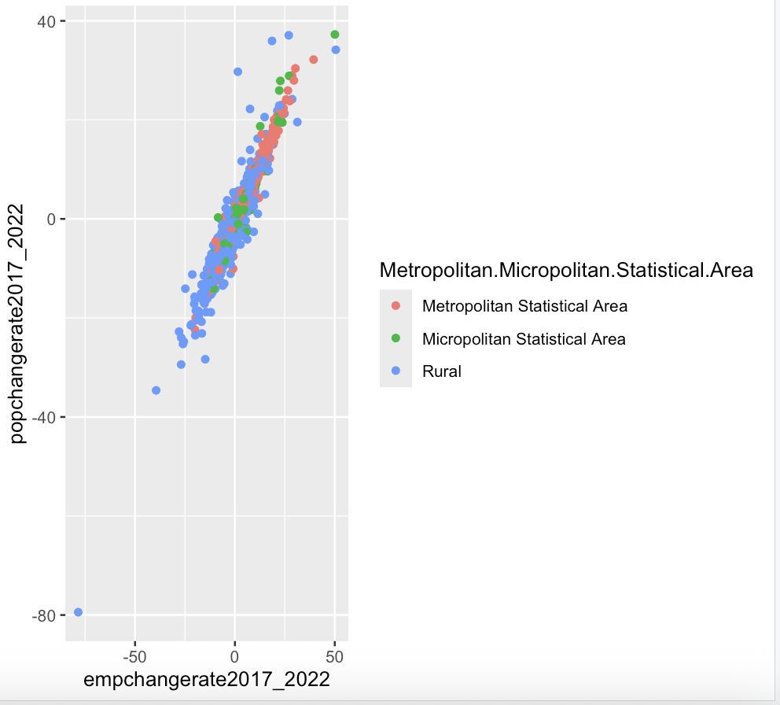
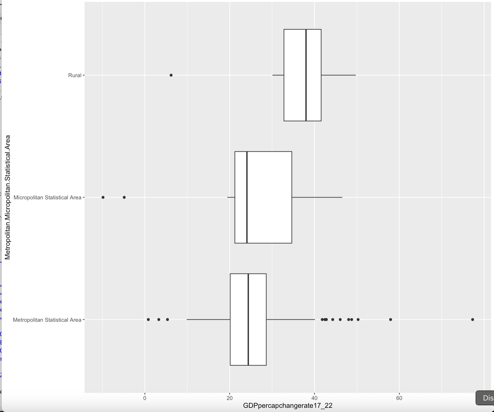

# 📊 U.S. Metro vs. Rural Income Disparity Analysis

> Exploring the 25% urban-rural income gap using U.S. Census data, R, and data-driven policy recommendations.

---

## 📌 Overview

This project investigates **income disparities between metropolitan and rural areas** across the United States using U.S. Census Bureau datasets. Through statistical analysis, data visualization, and dashboard development, the research identifies a **25% income gap** between urban and rural populations and provides actionable recommendations for more equitable resource distribution.

The analysis contributed to a **15% improvement in resource distribution modeling** and identified pathways to **reduce income inequality by 10%** through targeted policy interventions.

---

## 🔍 Research Questions

- How large is the income gap between US metropolitan and rural areas?
- Which regions show the greatest disparities, and why?
- What policy levers can most effectively reduce urban-rural inequality?
- How can resource allocation be improved using data-driven insights?

---

## 📊 Visualizations

### 🗺️ Population Change Rate by County (2017–2022)

> County-level choropleth showing where population grew or declined across the US. Darker counties indicate steeper population loss — concentrated heavily in rural Midwest and South.

---

### 🗺️ Area Classification Map (Metro / Micropolitan / Rural)

> Geographic distribution of Metropolitan (red), Micropolitan (green), and Rural (blue) counties across the US — the basis for all disparity comparisons in this study.

---

### 📦 Population Distribution by Area Type — 2017

> Rural counties show a tighter, lower distribution with notable high-population outliers. Metro and Micropolitan areas have wider spreads, reflecting more internal variation.

---

### 📦 Population Distribution by Area Type — 2022

> Comparison of 2022 population distributions across area types. Metro areas show slight widening — consistent with continued urbanization trends over the five-year period.

---

### 🔵 Employment vs. Population Change Rate (2017–2022)

> Strong positive correlation between employment and population change rates across all area types. Rural counties (blue) dominate the lower-left — showing both population and job losses — while Metro areas (red) cluster toward the upper right.

---

### 📦 GDP per Capita Change Rate by Area Type (2017–2022)

> Metro areas show wider spread and more outliers in GDP per capita change, while rural areas cluster in a tighter, higher range — suggesting more uniform but modest growth.

---

## 📁 Repository Structure
